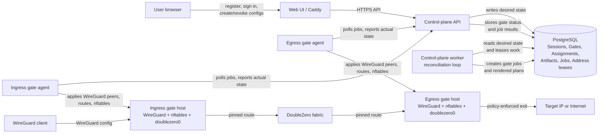

# DoubleZero WireGuard VPN

DoubleZero WireGuard VPN is a self-service control plane for issuing WireGuard
configs that route traffic through DoubleZero-backed gate servers.

The target operator experience is:

1. Bring several Linux servers that will become Hyperspace gates.
2. Obtain DoubleZero `access-pass` records for those gate servers.
3. Deploy the control plane, database, web UI, and gate agents.
4. Let users register, sign in, choose ingress and egress gates, and download
   WireGuard configs.

Users of the issued WireGuard configs do not need to install DoubleZero. Only
the gate servers run DoubleZero and expose ordinary WireGuard entry points to
clients.

The platform can be deployed over either DoubleZero testnet or DoubleZero
mainnet-beta. The choice is made when provisioning the gate hosts and their
DoubleZero `access-pass` records.

## Prerequisites

You need infrastructure before this repository can become useful:

- Minimum first deployment: three servers.
- Server 1: web UI, control-plane API, control-plane worker, and PostgreSQL.
- Server 2: ingress gate.
- Server 3: egress gate.
- Optional production split: separate web, control-plane, PostgreSQL, and
  observability hosts.
- One public HTTPS endpoint for the web UI.
- Optional but recommended: one observability host for Prometheus and Grafana.
- At least two gate hosts, because the current routing model uses one ingress
  gate and one distinct egress gate for every VPN config.

Each gate host needs:

- Ubuntu 24.04 LTS or a comparable modern Linux distribution.
- A stable public IPv4 address.
- Root or sudo access.
- `wireguard-tools`, `iproute2`, `nftables`, and the DoubleZero client/daemon.
- A DoubleZero identity/keypair. The gate catalog `identity` field is the
  DoubleZero `user_payer` identity returned by `doublezero address` on that
  gate host.
- A DoubleZero `access-pass` for that identity and the gate public IP. This is
  mandatory; a gate without an `access-pass` cannot connect to DoubleZero and
  must not be marked schedulable.

In DoubleZero terms, an `access-pass` is an on-chain authorization that binds a
DoubleZero identity (`user_payer`) to an allowed public IP address. See the
DoubleZero state model and CLI implementation:

https://github.com/malbeclabs/doublezero/blob/main/smartcontract/programs/doublezero-serviceability/src/state/accesspass.rs

https://github.com/malbeclabs/doublezero/blob/main/smartcontract/cli/src/accesspass/set.rs

`doublezero connect` will not provision `doublezero0` unless the address from
`doublezero address` and the server public IP match an `access-pass`.

DoubleZero documents `access-pass` verification in its troubleshooting guide:
https://docs.malbeclabs.com/troubleshooting/

Access is permissioned. If you need `access-pass` records for a new use case or
tenant, contact the DoubleZero team through the official form linked from the
New Tenant page:
https://docs.malbeclabs.com/New%20Tenant/

Direct form URL:
https://docs.google.com/forms/d/e/1FAIpQLSdp11kHtmcaKaLfYRZA92ylOvucipY86CdjVKdiggNdjlZniw/viewform

## Gate Location Planning

Do not place gates randomly. The fastest deployment usually puts each
Hyperspace gate close to a DoubleZero point of presence that is close to the
traffic it will serve.

Plan at least two locations:

- Ingress gate: near the source clients that will initiate WireGuard
  connections.
- Egress gate: near the destination side or desired internet exit location.

Recommended process:

1. From a representative source network, install DoubleZero tooling and run
   `doublezero latency`.
2. Identify the nearest reachable DoubleZero device or metro.
3. Choose a VPS or bare-metal provider location physically and
   network-wise close to that DoubleZero point of presence.
4. Provision the ingress gate there.
5. Repeat the same process from a representative destination or exit-side
   location to select the egress gate placement.
6. Ask the DoubleZero team to issue `access-pass` records for the final gate
   public IPs and DoubleZero identities.

See [Gate Location Planning](docs/runbooks/gate-location-planning.md) for a
more detailed workflow.

## Architecture



The control plane follows a declarative resource model:

- `Session` describes the VPN product intent.
- `GateAssignment` describes the desired work on one gate.
- `Gate` describes a managed gate host and scheduling state.
- `RenderedPlan` is immutable per session generation.
- `Artifact` controls client config issuance and invalidation.
- `Job` and `JobAttempt` provide row-level leased execution history.

The main control-plane pattern is a reconciliation loop. API requests do not
directly mutate gate hosts. Instead, the API validates user intent and writes
the desired state to PostgreSQL. The worker repeatedly compares that desired
state with the latest reported gate state, leases the required work, renders
idempotent gate jobs, and retries until the actual gate state matches the
desired state. Creation, revocation, deletion, repair, and route health changes
all pass through the same reconciliation loop.

## Repository Layout

```text
apps/
  control-plane-api/      Fastify API process
  control-plane-worker/   scheduler and reconciler process
  gate-agent/             Go gate agent
  web/                    management UI
packages/
  contracts/              schema-first API and resource contracts
  db/                     PostgreSQL migrations and SQL helpers
  shared/                 shared TypeScript utilities
infra/
  caddy/                  Caddy entrypoint templates
  systemd/                bare-metal service units
  postgres/               PostgreSQL deployment notes
  observability/          metrics and logging deployment notes
docs/
  architecture/           target architecture documentation
  api/                    API surface documentation
  runbooks/               deployment and validation runbooks
  operations/             security and operational procedures
```

## Development

Install Node.js active LTS and Go 1.23 or newer.

```bash
npm install
npm run build
npm test
```

Test and measurement workflows are separate. `npm test` runs the fast workspace
regression suite only. Live deployment checks are available as
`npm run test:live:ui` and `npm run test:live:policy`. Long-running
public-vs-Hyperspace connectivity matrices are explicit measurements:
`npm run measure:matrix -- ...` followed by `npm run measure:compare -- ...`.
See `docs/runbooks/long-running-measurement-matrix.md` for prerequisites.

Gate agent checks:

```bash
cd apps/gate-agent
go test ./...
```

## Deployment

Deployment is intentionally package-and-systemd oriented:

- PostgreSQL runs as a native service on the database host.
- API and worker run as separate systemd services from the same codebase.
- Gate agent runs as a Go binary under systemd.
- Caddy terminates TLS and routes API/web traffic.
- Observability is provided by Prometheus, Grafana, and exporters.

Start with [Deployment Guide](docs/runbooks/deployment.md).

For Milestone 1 acceptance evidence, use
[Milestone 1 Integration Validation](docs/runbooks/milestone1-integration-validation.md).

## License

This project is licensed under the Apache License, Version 2.0. See
[LICENSE](LICENSE). The SPDX license identifier is `Apache-2.0`.
